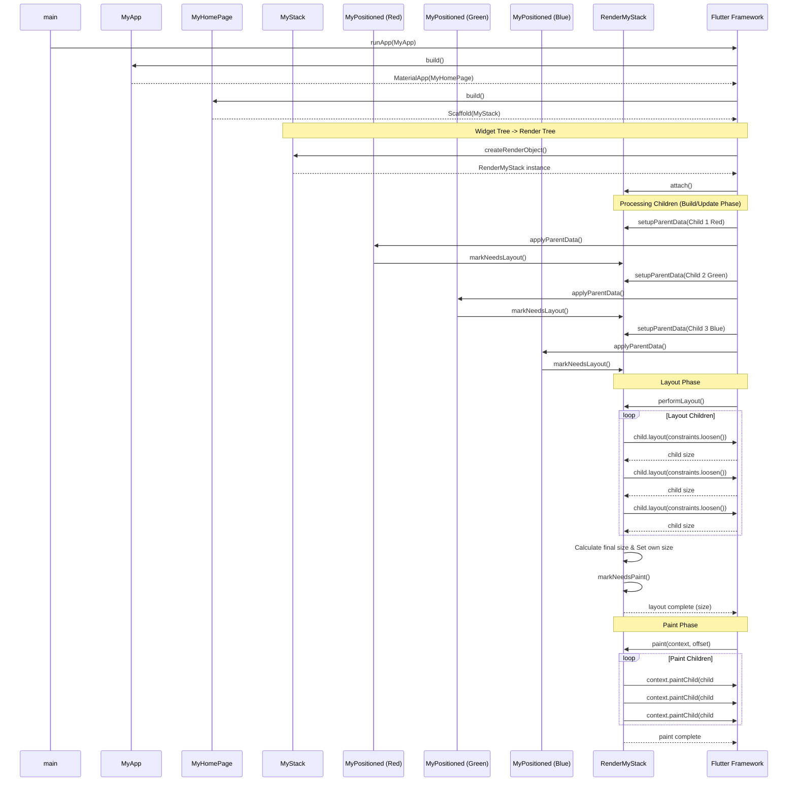

# flutter_custom_stack

## log

```
Restarted application in 22ms.
[log] [0] 應用啟動
[log] [1] MyApp.build: 構建 MyApp
[log] [2] MyHomePage.build: 構建 MyHomePage
[log] [3] MyStack.createRenderObject: 創建 RenderMyStack
[log] [4] RenderMyStack.attach: 附加到渲染管線
[log] [5] RenderMyStack.setupParentData: 設置子元素的 ParentData
[log] [6] RenderMyStack.setupParentData: 為子元素創建新的 MyStackParentData
[log] [7] RenderMyStack.markNeedsLayout: 標記需要重新佈局
[log] [8] MyPositioned.applyParentData: 開始設置 parent data
[log] [9] MyPositioned.applyParentData: 更新位置 - left: 0, top: 0
[log] [10] MyPositioned.applyParentData: 標記父物件需要重新布局
[log] [11] RenderMyStack.markNeedsLayout: 標記需要重新佈局
[log] [12] MyPositioned.applyParentData: 完成
[log] [13] RenderMyStack.setupParentData: 設置子元素的 ParentData
[log] [14] RenderMyStack.setupParentData: 為子元素創建新的 MyStackParentData
[log] [15] RenderMyStack.markNeedsLayout: 標記需要重新佈局
[log] [16] MyPositioned.applyParentData: 開始設置 parent data
[log] [17] MyPositioned.applyParentData: 更新位置 - left: 150, top: 50
[log] [18] MyPositioned.applyParentData: 標記父物件需要重新布局
[log] [19] RenderMyStack.markNeedsLayout: 標記需要重新佈局
[log] [20] MyPositioned.applyParentData: 完成
[log] [21] RenderMyStack.setupParentData: 設置子元素的 ParentData
[log] [22] RenderMyStack.setupParentData: 為子元素創建新的 MyStackParentData
[log] [23] RenderMyStack.markNeedsLayout: 標記需要重新佈局
[log] [24] MyPositioned.applyParentData: 開始設置 parent data
[log] [25] MyPositioned.applyParentData: 更新位置 - left: 80, top: 180
[log] [26] MyPositioned.applyParentData: 標記父物件需要重新布局
[log] [27] RenderMyStack.markNeedsLayout: 標記需要重新佈局
[log] [28] MyPositioned.applyParentData: 完成
[log] [29] RenderMyStack.performLayout: 開始計算佈局
[log] [30] RenderMyStack.performLayout: 佈局子元素 #0
[log] [31] RenderMyStack.performLayout: 子元素 #0 大小: Size(100.0, 100.0)
[log] [32] RenderMyStack.performLayout: 子元素 #0 位置: (0, 0)
[log] [33] RenderMyStack.performLayout: 佈局子元素 #1
[log] [34] RenderMyStack.performLayout: 子元素 #1 大小: Size(80.0, 80.0)
[log] [35] RenderMyStack.performLayout: 子元素 #1 位置: (150, 50)
[log] [36] RenderMyStack.performLayout: 佈局子元素 #2
[log] [37] RenderMyStack.performLayout: 子元素 #2 大小: Size(120.0, 60.0)
[log] [38] RenderMyStack.performLayout: 子元素 #2 位置: (80, 180)
[log] [39] RenderMyStack.performLayout: 最終大小: Size(300.0, 300.0)，子元素總數: 3
[log] [40] RenderMyStack.markNeedsPaint: 標記需要重新繪製
[log] [41] RenderMyStack.paint: 開始繪製，偏移: Offset(100.0, 362.0)
[log] [42] RenderMyStack.paint: 繪製子元素 #0，偏移: Offset(100.0, 362.0)
[log] [43] RenderMyStack.paint: 繪製子元素 #1，偏移: Offset(250.0, 412.0)
[log] [44] RenderMyStack.paint: 繪製子元素 #2，偏移: Offset(180.0, 542.0)
[log] [45] RenderMyStack.paint: 繪製完成，總共繪製了 3 個子元素
```

