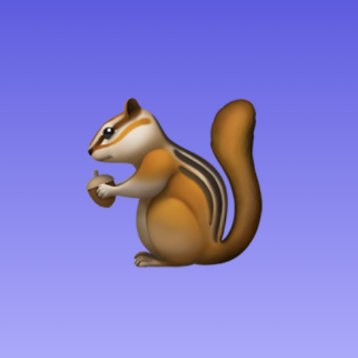
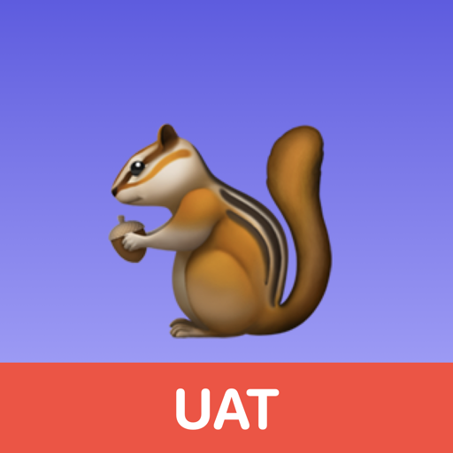
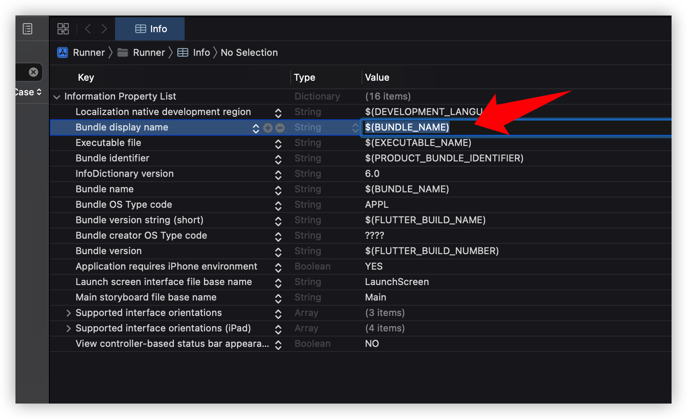
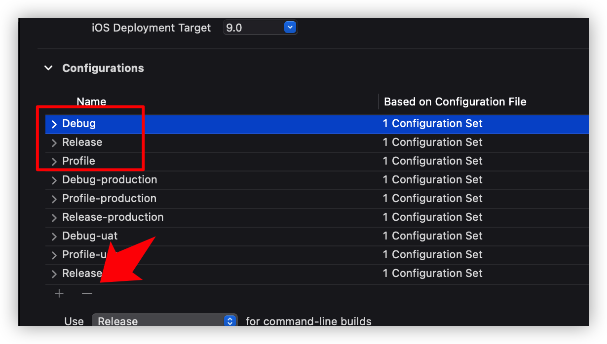
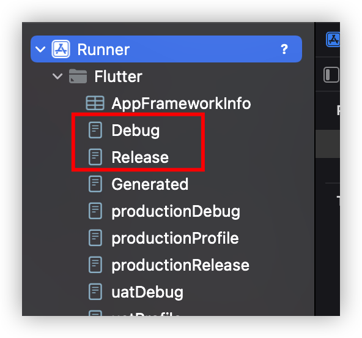
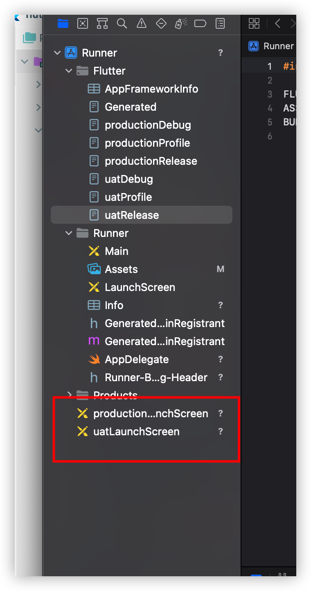
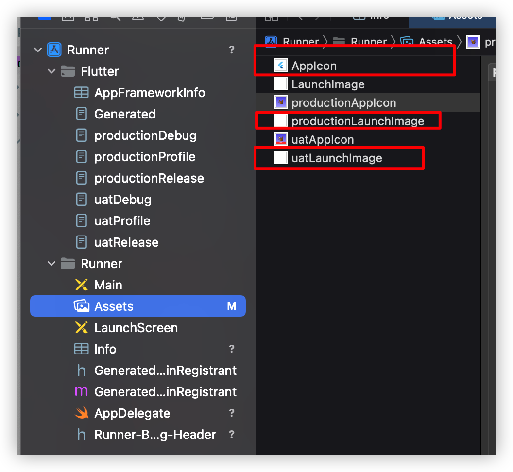
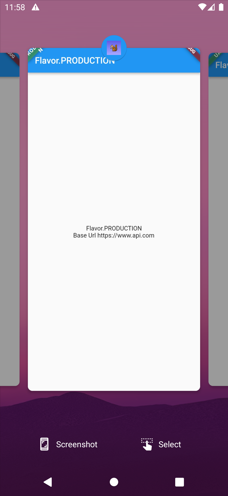
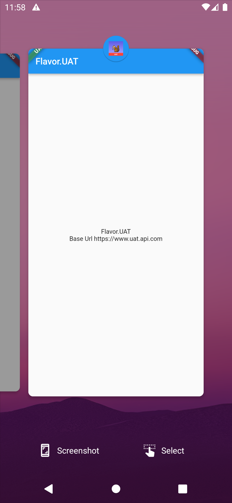
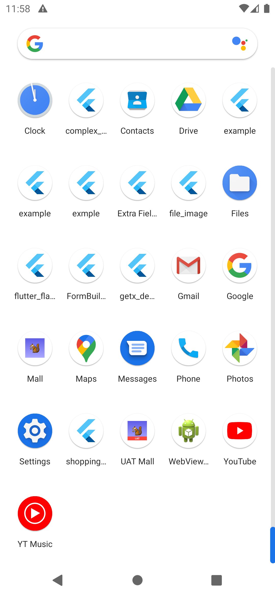

# flutter_flavorizr


> [flutter_flavorizr](https://pub.dev/packages/flutter_flavorizr) is meant to be run once and only once
>
> https://github.com/AngeloAvv/flutter_flavorizr/issues/4#issuecomment-638034165

這個library的設計是只生成**一次**，並不是每次更新再重新生成，這樣會覆蓋舊的文件。

如果要更新的話，可以嘗試使用 `process`

---

## Goals

|           |         Production         | UAT |
| :-------: | :-----------------: | :-------------: |
| bundle Id | com.mall.app | com.mall.app.uat |
| app name  | Mall | UAT Mall |
|   icon    |  |  |
| base url | https://www.api.com | https://www.uat.api.com |


---

1. Save app icon to flutter assets folder

   

2. config `flutter_flavorizr` setting in `pubspec.yaml`

   ```
   flavorizr:
     ide: "idea"
     app:
       android:
         flavorDimensions: "flavor-type"
       ios:
   
     flavors:
       production:
         app:
           name: "Mall"
           icon: "assets/app_icon/production_app_icon.png"
         android:
           applicationId: "com.mall.app"
         ios:
           bundleId: "com.mall.app"
       uat:
         app:
           name: "UAT Mall"
           icon: "assets/app_icon/uat_app_icon.png"
         android:
           applicationId: "com.mall.app.uat"
         ios:
           bundleId: "com.mall.app.uat"
   ```

3. run `flutter pub run flutter_flavorizr`

4. add `$(BUNDLE_NAME)` to Bundle display name in info.plist

   https://github.com/AngeloAvv/flutter_flavorizr/issues/97

   

5. [iOS] Delete the following files that are not useful

   1. Delete xcode default configurations, because I don't seem to use

      

   2.  Delete the `{env}LaunchScreen` generated by flutter_flavorizr default

      

3. Delete extra Assets

   

4. rename `flavors.dart` to `env_config.dart`

   add baseUrl

   ```
   enum Flavor {
     PRODUCTION,
     UAT,
   }
   
   class EnvConfig {
     static Flavor? appFlavor;
   
     static String get name => appFlavor?.name ?? '';
   
     static String get title {
      return appFlavor.toString();
     }
   
     static String get baseUrl {
       switch (appFlavor) {
         case Flavor.PRODUCTION:
           return 'https://www.api.com';
         case Flavor.UAT:
           return 'https://www.uat.api.com';
         default:
           return 'https://www.uat.api.com';
       }
     }
   }
   ```

---

```
flutter run --flavor production -t lib/main_production.dart
flutter run --flavor uat -t lib/main_uat.dart
```

|           |         Production         | UAT |  |
| :-------: | :-----------------: | :-------------: | --------- |
| Android |  |  |  |
| iOS |  |  |  |

