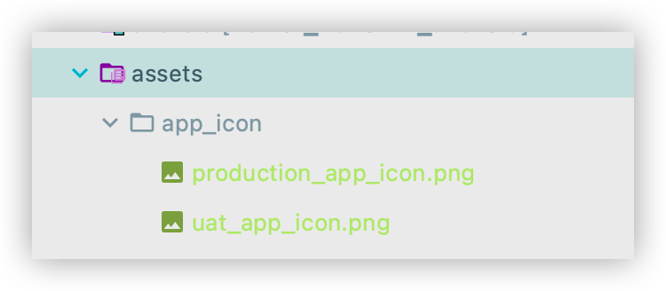

# flutter_flavorizr


> [flutter_flavorizr](https://pub.dev/packages/flutter_flavorizr) is meant to be run once and only once
>
> https://github.com/AngeloAvv/flutter_flavorizr/issues/4#issuecomment-638034165

這個library的設計是只生成**一次**，並不是每次更新再重新生成，這樣會覆蓋舊的文件。

如果要更新的話，可以嘗試使用 `process`

---

## Goals

|           |         Production         | UAT |
| :-------: | :-----------------: | :-------------: |
| bundle Id | com.mall.app | com.mall.app.uat |
| app name  | Mall | UAT Mall |
|   icon    |  |  |
| base url | https://www.api.com | https://www.uat.api.com |


---

1. Save app icon to flutter assets folder

   

2. config `flutter_flavorizr` setting in `pubspec.yaml`

   ```
   flavorizr:
     ide: "idea"
     app:
       android:
         flavorDimensions: "flavor-type"
       ios:
   
     flavors:
       production:
         app:
           name: "Mall"
           icon: "assets/app_icon/production_app_icon.png"
         android:
           applicationId: "com.mall.app"
         ios:
           bundleId: "com.mall.app"
       uat:
         app:
           name: "UAT Mall"
           icon: "assets/app_icon/uat_app_icon.png"
         android:
           applicationId: "com.mall.app.uat"
         ios:
           bundleId: "com.mall.app.uat"
   ```

3. run `flutter pub run flutter_flavorizr`

4. add `$(BUNDLE_NAME)` to Bundle display name in info.plist

   https://github.com/AngeloAvv/flutter_flavorizr/issues/97

   

5. 
